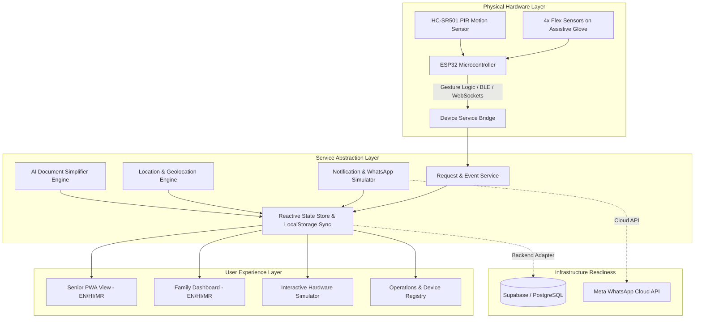

# 🤝 SAATHI (साथी)
### Smart Assistance & Accessible Technology for Independent Living

> **"Technology that helps people communicate when communication itself becomes difficult."**

SAATHI is a unified assistive ecosystem connecting senior citizens, elderly individuals living alone, and people with limited mobility or paralysis with their family caregivers through a senior-first progressive web application (PWA), real-time physical hardware integration (ESP32 + Flex Sensors + PIR motion sensing), and smart AI assistance.

---

## 🌟 Key Pillars

1. **Senior-First Progressive Web App (PWA)**:
   - Ultra-large typography (24px–48px), high-contrast touch targets (64px+), 3-second comprehension design.
   - 1-Touch Quick Requests: *"I am hungry"*, *"I am thirsty"*, *"Need medicine"*, *"Need washroom"*, *"In pain"*, *"Contact family"*.
   - Prominent Red **SOS / Emergency Action** with 2-step confirmation and direct links to Family, Ambulance (108), Police (112), and Senior Helpline (14567).
   - Daily Wellbeing Check-In (*"I am okay today"*) with instant family notification.
   - Built-in Voice Assistance (Web Speech API text-to-speech) reading buttons and dialogs aloud for low-vision seniors.

2. **Family Caregiver Command Hub**:
   - Live real-time status stream: 🟢 Safe / 🟠 Attention / 🔴 Emergency.
   - Today's Check-in monitor with gentle reminder dispatches.
   - Real-time request response actions: **Acknowledge**, **Call Senior**, **Mark Resolved**.
   - **Simulated WhatsApp Alert Gateway**: Previews formatted alert dispatches with sender info, timestamps, and priority tags ready for Meta Cloud API.

3. **Hardware Assistive Glove (ESP32 + 4 Flex Sensors + PIR)**:
   - Real-time gesture recognition for bedridden or speech-impaired individuals.
   - Interactive **Hardware Simulator** with live ADC sliders (0–1023) and 1-click preset gesture triggers for hackathon evaluations.
   - Ambient PIR Room Motion Sensor monitoring daily room activity without privacy-invasive cameras.

4. **AI Document Simplifier**:
   - Converts complex medical prescriptions, government pension letters (Jeevan Pramaan), and utility bills into clear, bulleted action items in simple plain language.

5. **Multilingual Independence (English, Hindi, Marathi)**:
   - Complete localized dictionaries (`locales/en.json`, `locales/hi.json`, `locales/mr.json`).
   - Senior and Caregiver can independently select their preferred language (e.g., Senior in Marathi, Caregiver in English) with structured request translation.

6. **Nearby Essential Services**:
   - GPS proximity-sorted directory of Hospitals, 24x7 Pharmacies, Ambulance hubs, and Senior Welfare Centres with direct calling and directions.

---

## 📐 System Architecture



---

## 🖐️ Hardware Gesture Mappings

| Gesture ID | Finger Bend Pattern | Target Request | Meaning / Trigger |
| :--- | :--- | :--- | :--- |
| **`gesture-hungry`** | Index + Middle Bent `[1, 1, 0, 0]` | `HUNGRY` | "I am hungry / Need food" |
| **`gesture-thirsty`** | Index Bent `[1, 0, 0, 0]` | `THIRSTY` | "I am thirsty / Need water" |
| **`gesture-medicine`** | Index + Thumb Pinch `[1, 0, 0, 1]` | `MEDICINE` | "Time for scheduled pills" |
| **`gesture-family`** | Open Palm Hold `[0, 0, 0, 1]` | `FAMILY` | "Want to talk to caregiver" |
| **`gesture-toilet`** | Middle + Ring Bent `[0, 1, 1, 0]` | `TOILET` | "Assistance for washroom" |
| **`gesture-sos`** | Full Clenched Fist `[1, 1, 1, 1]` | `EMERGENCY` | "Critical Emergency SOS" |

---

## 🛠️ Technology Stack

- **Framework**: [Next.js 14 (App Router)](https://nextjs.org/)
- **Language**: [TypeScript](https://www.typescriptlang.org/)
- **Styling**: [Tailwind CSS](https://tailwindcss.com/)
- **Icons**: [Lucide React](https://lucide.dev/)
- **PWA**: Web App Manifest, Service Worker (`sw.js`), Install Banner
- **Speech Synthesis**: Web Speech API (`SpeechSynthesisUtterance`)
- **Effects**: Canvas Confetti
- **Deployment**: Vercel-ready with zero external database prerequisites for evaluation

---

## 🚀 2-Minute Live Demo Flow for Judges

1. **Open SAATHI**: Launch the app. Notice the clean top bar with **Demo Mode Role Switcher** (`Senior`, `Family Hub`, `Hardware Sim`, `Admin`).
2. **Senior View in Marathi / Hindi**: Switch senior language to **मराठी (Marathi)**. Notice how the entire UI, greetings, requests, and dialogs change instantly.
3. **Trigger Quick Request**: Click *"मला भूक लागली आहे"* (*"I am hungry"*). An audio confirmation plays, and an event is generated.
4. **Switch to Hardware Simulator**:
   - Go to `Hardware Sim` tab.
   - Click **"Simulate: I Am Thirsty"** or drag the Flex Sensor sliders.
   - Notice the live ADC values and gesture detection banner.
5. **Switch to Family Hub**:
   - Notice that the Caregiver language is in **English** while Senior was in **Marathi**.
   - Notice the live requests stream with the new Hardware gesture request marked with a purple **Hardware Gesture** badge.
   - Click **"Acknowledge"** and **"Mark Resolved"**.
   - Review the **Simulated WhatsApp Alert Banner** formatted for Priya Sharma (+91 98765 43210).
6. **Trigger Daily Check-In**:
   - Switch to Senior view -> click **"Daily Check-In"** -> click **"✓ I AM OKAY TODAY"**.
   - Enjoy the celebratory confetti and observe the status update on both views.
7. **AI Document Simplifier**:
   - Navigate to **"Explain Document"** tab.
   - Try the sample **Doctor's Medical Prescription** or **Govt Pension Letter**.
   - Click **"Explain This Document"** to see the 4-column plain-language summary with audio read-aloud.
8. **Nearby Services**:
   - Navigate to **"Nearby Help"** tab.
   - Filter by *Hospitals*, *Ambulance*, *24x7 Pharmacy*, and test location proximity sorting.

---

## 💻 Local Development & Build

```bash
# Install dependencies
npm install

# Start local development server
npm run dev

# Build production bundle
npm run build

# Start production server
npm run start
```

---

## 👥 Team & Licensing

Developed with ❤️ for accessibility, elderly dignity, and independent living. MIT Licensed.
